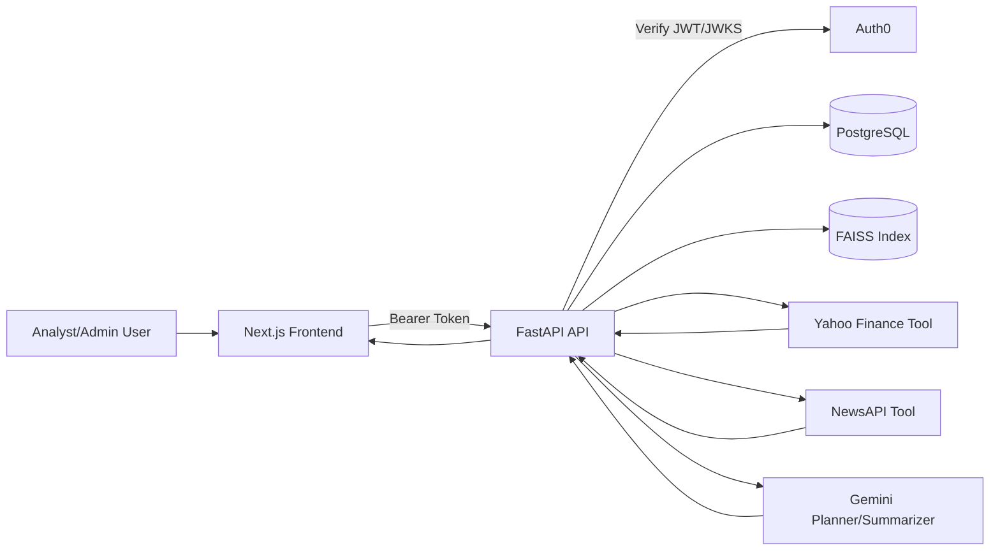

# Architecture

## 1. System Overview
This project implements Option A (Investment Research Dashboard) as a multi-tenant full-stack web app where AI is an integrated feature.

Primary components:
1. Next.js frontend
- Authenticated product UI for research, saved reports, watchlist, and admin workflows.
2. FastAPI backend
- Auth verification, tenant and RBAC enforcement, orchestration, CRUD APIs, and persistence.
3. PostgreSQL (Supabase-compatible)
- Shared-schema multi-tenant relational storage.
4. FAISS local index
- Document chunk retrieval for filing/earnings context.
5. External tools
- Yahoo Finance via yfinance.
- NewsAPI (with planned RSS fallback).
6. LLM layer (Gemini)
- Tool planning and executive-summary synthesis.

## 2. Architecture Diagram (Logical)

## 3. End-to-End Data Flow
### 3.1 Research Query Flow
1. User submits natural-language query on dashboard.
2. Frontend calls `POST /api/v1/research/run` (or `/run-and-save`).
3. Backend resolves user, tenant, and role from Auth0 JWT + membership.
4. Gemini planner proposes tool usage (`market/news/documents`) with ticker hints.
5. Backend applies safe fallback heuristics if planner is unavailable or malformed.
6. Tool adapters fetch market/news/document context.
7. Orchestrator synthesizes structured sections with source citations.
8. Optional summary is generated via Gemini with strict context inputs.
9. `/run-and-save` additionally persists report + sections + citations.
10. Frontend renders structured cards/tables/charts and citation details.

### 3.2 Saved Report Retrieval Flow
1. Frontend requests `GET /api/v1/reports` with optional `search` and `tag` filters.
2. Backend enforces `org_id` scoping and returns only tenant-owned reports.
3. Detail fetch `GET /api/v1/reports/{id}` returns sections + citations + tags.
4. Users can add/remove tags via dedicated endpoints.

### 3.3 Organization Admin Flow
1. Admin opens `/admin` and loads organization members.
2. Admin creates invite code via `POST /api/v1/orgs/invites`.
3. Invite consumer can join with `POST /api/v1/orgs/join`.
4. Role checks enforce that invite creation is admin-only.

## 4. Multi-Tenant and RBAC Design
Pattern: shared-schema tenancy with explicit `org_id` scoping.

Controls:
1. Tenant resolution dependency (`get_tenant_context`) maps authenticated user to membership.
2. All tenant data queries include `WHERE org_id = current_tenant.org_id`.
3. RBAC roles are currently `admin` and `analyst`.
4. Admin-only operation: organization invite creation.

Leak-prevention principle:
- Any route returning tenant resources must enforce org filter at query level, not only at UI level.

## 5. AI Orchestration Design
Current orchestration behavior:
1. Parse query and infer candidate tickers.
2. Ask Gemini for JSON tool plan:
- `tickers`
- `use_market_data`
- `use_news`
- `use_documents`
3. Validate and sanitize plan.
4. Execute selected tools.
5. Assemble structured sections (`title`, `body`, `citations`).
6. Produce executive summary (Gemini) with explicit non-hallucination instruction.

Fallback strategy:
- If Gemini planning fails, use deterministic keyword-based logic.

## 6. Data Model / ER Summary
Core entities:
1. `organizations`
2. `users`
3. `organization_memberships` (role per org)
4. `organization_invites`
5. `research_reports`
6. `report_sections`
7. `report_citations`
8. `report_tags`
9. `company_watchlists`

Main relationships:
1. Organization 1:N Membership
2. User 1:N Membership
3. Report 1:N Sections
4. Section 1:N Citations
5. Report 1:N Tags
6. Organization 1:N Watchlist items

## 7. API Endpoint Catalog
### Health
1. `GET /api/v1/health`

### Research
1. `POST /api/v1/research/run`
2. `POST /api/v1/research/run-and-save`
3. `POST /api/v1/research/ingest-documents`

### Reports
1. `GET /api/v1/reports`
2. `GET /api/v1/reports/{report_id}`
3. `POST /api/v1/reports`
4. `PATCH /api/v1/reports/{report_id}`
5. `DELETE /api/v1/reports/{report_id}`
6. `POST /api/v1/reports/{report_id}/tags`
7. `DELETE /api/v1/reports/{report_id}/tags/{tag_name}`

### Organizations
1. `GET /api/v1/orgs/members`
2. `POST /api/v1/orgs/invites`
3. `POST /api/v1/orgs/join`

### Watchlist
1. `GET /api/v1/watchlist`
2. `POST /api/v1/watchlist`
3. `DELETE /api/v1/watchlist/{watchlist_id}`

## 8. Reliability and Security Notes
1. Auth0 JWT verification through JWKS.
2. Backend-only secret usage and external API calls.
3. Tenant and RBAC guards on protected endpoints.
4. Structured response models with pydantic validation.
5. Integration tests currently validate tenant isolation and admin gate checks.

## 9. Known Gaps / Next Hardening
1. Add centralized retry/timeout and circuit-breaker strategy per external tool.
2. Add structured logging and request correlation IDs.
3. Add cache and rate-limiting policy for external API protection.
4. Expand integration test coverage to tagging/watchlist/search workflows.
