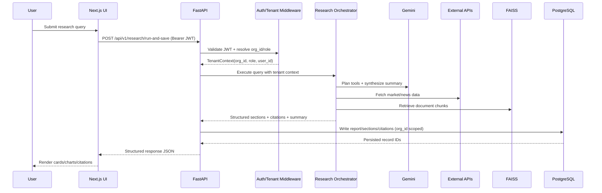
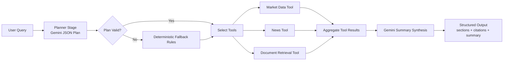

# Architecture

## 1. System Architecture
The project follows a decoupled architecture where the frontend serves as a thin client for the FastAPI backend, which acts as the central controller for authentication, database persistence, and AI orchestration.

Primary components:
1. Client layer (`apps/web`): Next.js frontend for dashboard, reports, watchlist, and admin workflows.
2. API layer (`apps/api`): FastAPI app with Auth0 JWT validation, tenant/RBAC resolution, business routes, and orchestration control.
3. Data layer: PostgreSQL (Supabase-compatible) for tenant-scoped persistence plus FAISS index for document context retrieval.
4. AI layer: Gemini for planning and summary synthesis.
5. External APIs: Yahoo Finance (market data) and NewsAPI (news/sentiment).

## 2. System Architecture Diagram (Logical)
```mermaid
flowchart TB
		subgraph Client[Client Layer (apps/web)]
				FE[Next.js Frontend]
		end

		FE -->|REST + JWT| SEC[Auth0 Security Middleware]

		subgraph API[API Layer (apps/api)]
				SEC -->|Validated Context| APP[FastAPI Application]
				APP -->|Execute Research| ORCH[Research Orchestrator]
		end

		subgraph Services[Data & AI Services]
				DB[(PostgreSQL DB)]
				VEC[(FAISS Vector Index)]
				LLM[Gemini LLM\n(Planner/Synthesizer)]
				EXT[Market & News APIs]
		end

		APP -->|CRUD (org_id scoped)| DB
		ORCH -->|Context Retrieval| VEC
		ORCH -->|Planning & Summary| LLM
		ORCH -->|External Data| EXT
```

## 3. High-Level Data Flow
1. Authentication: Users authenticate via Auth0; the frontend includes the Bearer token in API requests.
2. Context resolution: Backend validates JWT and resolves tenant context (`org_id`, `role`, `user_id`) via membership lookup.
3. Research orchestration: `run_research` triggers Gemini-assisted planning, external data fetches (yfinance, NewsAPI), FAISS retrieval, and structured synthesis.
4. Persistence: Reports, sections, tags, and citations are written to PostgreSQL with explicit organization scoping.

## 4. Data Flow Diagram (UI Input to Rendered Output)


## 5. Database Schema / ER Diagram
```mermaid
erDiagram
		ORGANIZATIONS ||--o{ ORGANIZATION_MEMBERSHIPS : has
		USERS ||--o{ ORGANIZATION_MEMBERSHIPS : belongs_to
		ORGANIZATIONS ||--o{ ORGANIZATION_INVITES : has
		ORGANIZATIONS ||--o{ RESEARCH_REPORTS : owns
		USERS ||--o{ RESEARCH_REPORTS : creates
		RESEARCH_REPORTS ||--o{ REPORT_SECTIONS : contains
		REPORT_SECTIONS ||--o{ REPORT_CITATIONS : cites
		RESEARCH_REPORTS ||--o{ REPORT_TAGS : tagged_with
		ORGANIZATIONS ||--o{ COMPANY_WATCHLISTS : tracks

		ORGANIZATIONS {
			int id PK
			string name
			datetime created_at
		}
		USERS {
			int id PK
			string auth0_sub UNIQUE
			string email
			string full_name
			datetime created_at
		}
		ORGANIZATION_MEMBERSHIPS {
			int id PK
			int org_id FK
			int user_id FK
			enum role
		}
		RESEARCH_REPORTS {
			int id PK
			int org_id FK
			int created_by_user_id FK
			string title
			text query_text
			string status
			text summary
			datetime created_at
			datetime updated_at
		}
		REPORT_SECTIONS {
			int id PK
			int report_id FK
			string title
			text body
			int order_index
		}
		REPORT_CITATIONS {
			int id PK
			int section_id FK
			string source_type
			string source_name
			text reference
		}
		REPORT_TAGS {
			int id PK
			int report_id FK
			string name
		}
		COMPANY_WATCHLISTS {
			int id PK
			int org_id FK
			string ticker
			string company_name
			datetime created_at
		}
		ORGANIZATION_INVITES {
			int id PK
			int org_id FK
			string code UNIQUE
			datetime expires_at
			datetime used_at
			datetime created_at
		}
```

Key indexes currently implemented:
1. `users.auth0_sub` unique index for auth lookup.
2. `research_reports.org_id` + composite index `ix_reports_org_created(org_id, created_at)` for tenant queries.
3. `report_tags.report_id` and `report_tags.name` for report filtering.
4. `company_watchlists.org_id` and `company_watchlists.ticker` for tenant watchlist operations.

Audit logs:
1. Dedicated audit-event table is not yet implemented.
2. Current traceability is through timestamps, ownership fields, and request logging.

## 6. AI Orchestration Flow


Execution behavior:
1. Planner decides tool usage and ticker hints.
2. Tools execute sequentially per selected scope and produce normalized sections.
3. Aggregated sections are optionally summarized by Gemini.
4. Final response is returned in a typed schema (`title`, `executive_summary`, `sections`, `citations`).

## 7. Multi-Tenant Data Flow (Isolation)
```mermaid
flowchart LR
		R[HTTP Request + Bearer JWT] --> JV[JWT Verify (Auth0 JWKS)]
		JV --> TC[Resolve TenantContext\norg_id + role + user_id]
		TC --> RG[Route Handler]
		RG --> QF[Apply org_id filter in query]
		QF --> DB[(PostgreSQL)]
		DB --> RESP[Tenant-scoped response only]
```

Isolation enforcement points:
1. Authentication and token verification.
2. Tenant context resolution from membership.
3. Query-level `org_id` scoping on every tenant-owned resource.
4. Role checks (`admin`, `analyst`) for privileged actions.

Leak-prevention guarantee:
1. Org A and Org B requests resolve different `org_id` values.
2. Data access is constrained by `org_id` at backend query level, not just UI filtering.

## 8. API Design (Methods, Auth, Request/Response)
All endpoints are under `/api/v1`.

| Endpoint | Method | Auth | Request Shape | Response Shape |
|---|---|---|---|---|
| `/health` | GET | No | None | `{ status: "ok" }` |
| `/research/run` | POST | JWT required | `{ query: string }` | `ResearchResponse` |
| `/research/run-and-save` | POST | JWT required | `{ query: string }` | `ResearchResponse` + persisted `report_id` |
| `/research/ingest-documents` | POST | JWT required | None | `{ status, ingested_chunks }` |
| `/reports` | GET | JWT required | Query: `search?`, `tag?` | `ReportOut[]` (tenant scoped) |
| `/reports/{id}` | GET | JWT required | Path: `id` | `ReportDetailOut` |
| `/reports` | POST | JWT required | `ReportCreate` | `ReportOut` |
| `/reports/{id}` | PATCH | JWT required | `ReportUpdate` | `ReportOut` |
| `/reports/{id}` | DELETE | JWT required | Path: `id` | `204 No Content` |
| `/reports/{id}/tags` | POST | JWT required | Query: `name` | `ReportOut` |
| `/reports/{id}/tags/{tag}` | DELETE | JWT required | Path: `id`, `tag` | `ReportOut` |
| `/watchlist` | GET | JWT required | None | `WatchlistOut[]` |
| `/watchlist` | POST | JWT required | `WatchlistCreate` | `WatchlistOut` |
| `/watchlist/{id}` | DELETE | JWT required | Path: `id` | `204 No Content` |
| `/orgs/members` | GET | JWT required | None | `MembershipOut[]` |
| `/orgs/invites` | POST | JWT required (`admin`) | None | `InviteOut` |
| `/orgs/join` | POST | JWT required | `{ invite_code: string }` | `MembershipOut` |

## 9. Reliability and Security Notes
1. Auth0 JWT verification through JWKS.
2. Backend-only handling of secret API keys.
3. Tenant and RBAC guards on protected routes.
4. Structured response models with pydantic validation.
5. Integration tests cover tenant isolation and admin gate checks.

## 10. Known Gaps / Next Hardening
1. Add centralized retries/circuit-breakers per external tool.
2. Add richer observability dashboards and tracing.
3. Add dedicated audit-event persistence.
4. Expand integration tests for failure-path behavior.
